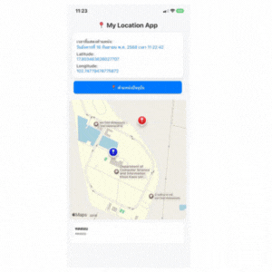
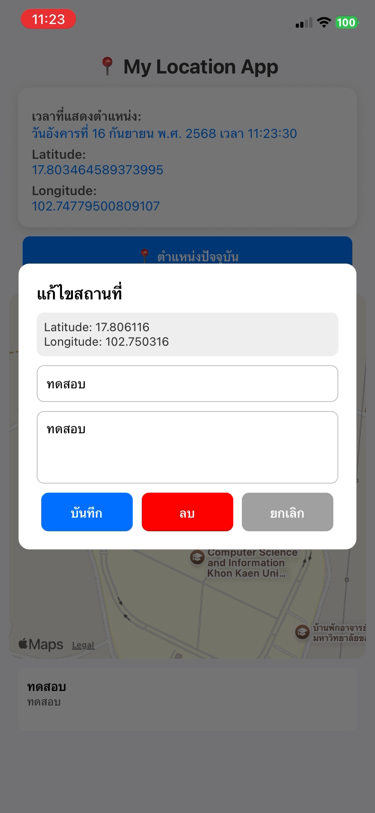
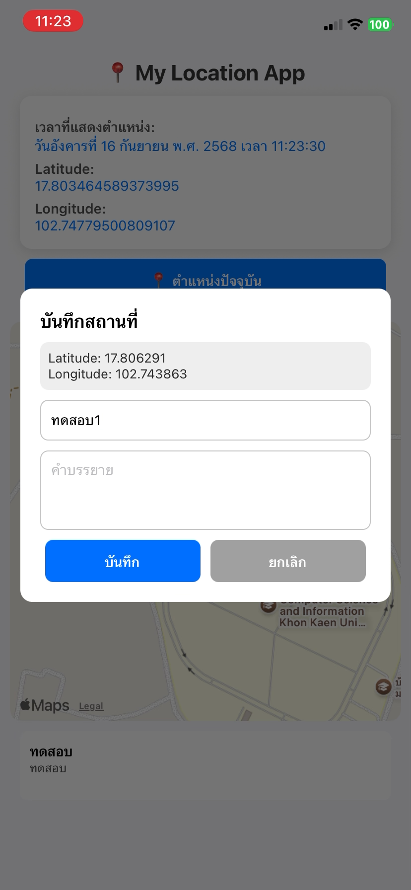
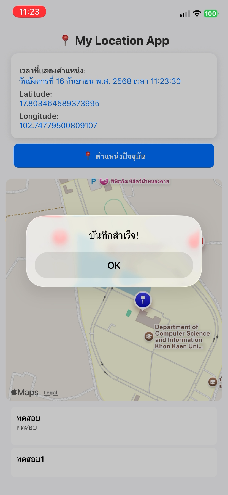
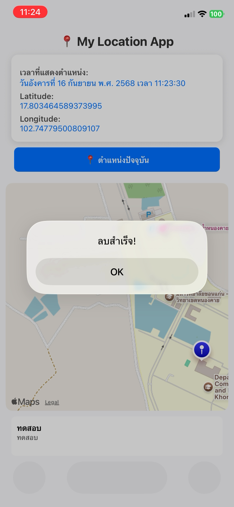

````markdown
# My Location App

[](https://opensource.org/licenses/MIT)
[](https://expo.dev/)

My Location App เป็นแอปพลิเคชันมือถือที่พัฒนาด้วย React Native และ Expo ที่ช่วยให้ผู้ใช้สามารถดูตำแหน่งปัจจุบันของตนเองบนแผนที่ บันทึกสถานที่ที่กำหนดเอง และจัดการสถานที่เหล่านั้นได้

## ✨ คุณสมบัติ

- **ตำแหน่งปัจจุบัน**: แสดงละติจูด ลองจิจูดปัจจุบัน และเวลาที่ดึงตำแหน่ง.
- **แผนที่แบบโต้ตอบ**: ใช้ `react-native-maps` ร่วมกับไทล์ OpenStreetMap เพื่อแสดงผลแผนที่โดยละเอียด.
- **บันทึกสถานที่ที่กำหนดเอง**: แตะที่ใดก็ได้บนแผนที่เพื่อเพิ่มสถานที่ใหม่พร้อมชื่อและคำอธิบาย.
- **แก้ไขและลบสถานที่**: กดค้างที่หมุด (marker) หรือเลือกสถานที่จากรายการเพื่อแก้ไขรายละเอียดหรือลบออก.
- **รายการสถานที่**: ดูสถานที่ที่คุณบันทึกไว้ทั้งหมดในรายการที่เลื่อนได้ด้านล่างแผนที่.
- **นำทางไปยังสถานที่**: แตะที่สถานที่ที่บันทึกไว้ในรายการเพื่อเลื่อนแผนที่ไปยังตำแหน่งนั้น.
- **การจัดการสิทธิ์การเข้าถึงตำแหน่ง**: ร้องขอสิทธิ์การเข้าถึงตำแหน่งเบื้องหน้าอย่างเหมาะสม.

## 🚀 เริ่มต้นใช้งาน

ทำตามคำแนะนำเหล่านี้เพื่อติดตั้งและเรียกใช้โปรเจกต์บนเครื่องของคุณสำหรับการพัฒนาและทดสอบ.

### ข้อกำหนดเบื้องต้น

- Node.js
> การใช้ `npx expo install` ช่วยให้มั่นใจได้ถึงความเข้ากันได้กับเวอร์ชัน Expo SDK ของคุณ

### สร้างโปรเจกต์

สร้างโปรเจกต์ Expo ใหม่โดยใช้เทมเพลต **blank TypeScript**:

```bash
npx create-expo-app@latest camera-app --template blank-typescript
```
````

### ติดตั้งไลบรารีที่จำเป็น

ในการเข้าถึงกล้องและคลังสื่อ ให้ติดตั้ง:

```bash
cd camera-app
npx expo install expo-camera expo-media-library
```
## 📸 คลิปการใช้งาน


## Screenshots
<table>
  <tr>
    <td>
      <br>
    </td>
    <td>
      <br>
    </td>
    <td>
      <br>
    </td>
    <td>
      <br>
    </td>
  </tr>
</table>

### เรียกใช้แอป

1.  **เริ่ม Expo development server:**

```bash
npx expo start
```

    คำสั่งนี้จะเปิดแท็บใหม่ในเบราว์เซอร์ของคุณพร้อมกับ Expo DevTools.

2.  **รันบนอุปกรณ์/simulator ของคุณ:**

    - **อุปกรณ์ iOS/Android**: สแกน QR code ที่แสดงใน terminal หรือ Expo DevTools ด้วยแอป Expo Go.
    - **iOS Simulator**: กด `i` ใน terminal.
    - **Android Emulator**: กด `a` ใน terminal.

    ตรวจสอบให้แน่ใจว่าอุปกรณ์/emulator ของคุณได้เปิดใช้งานบริการระบุตำแหน่งแล้ว.


## 🛠️ สร้างด้วย

- [React Native](https://reactnative.dev/) - เฟรมเวิร์กสำหรับการสร้างแอปพลิเคชันเนทีฟ.
- [Expo](https://expo.dev/) - เฟรมเวิร์กและแพลตฟอร์มสำหรับแอปพลิเคชัน React แบบ universal.
- [expo-location](https://docs.expo.dev/versions/latest/sdk/location/) - สำหรับการเข้าถึงตำแหน่งของอุปกรณ์.
- [react-native-maps](https://github.com/react-native-maps/react-native-maps) - คอมโพเนนต์แผนที่สำหรับ React Native.
- [OpenStreetMap](https://www.openstreetmap.org/) - ให้บริการไทล์แผนที่ที่ใช้ในแอปพลิเคชัน.

## 🤝 การมีส่วนร่วม

หากคุณมีข้อเสนอแนะที่จะทำให้สิ่งนี้ดีขึ้น โปรด fork repository และสร้าง pull request คุณยังสามารถเปิด issue พร้อมแท็ก "enhancement" ได้.
อย่าลืมกดติดดาวให้โปรเจกต์! ขอบคุณอีกครั้ง!

1.  Fork โปรเจกต์
2.  สร้าง Branch สำหรับฟีเจอร์ของคุณ (`git checkout -b feature/AmazingFeature`)
3.  คอมมิตการเปลี่ยนแปลงของคุณ (`git commit -m 'Add some AmazingFeature'`)
4.  พุชไปยัง Branch (`git push origin feature/AmazingFeature`)
5.  เปิด Pull Request

## 👤 ผู้สร้าง

**ธนโชค สุวรรณ์**

- 🌐 Facebook: [Thanachok Suwan](https://facebook.com/thanachok.boss)
- 💻 GitHub: [thanachok11](https://github.com/thanachok11)

---

สร้างสรรค์ด้วย ❤️ สำหรับรายวิชา _การเขียนโปรแกรมแอปพลิเคชันบนมือถือแบบไฮบริด_ (**IN405109**)
**วิทยาการคอมพิวเตอร์, มหาวิทยาลัยขอนแก่น**
